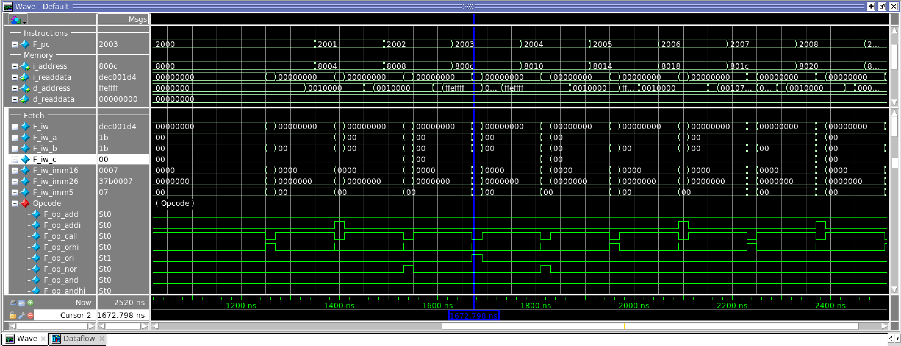

# SoC Simulation Tips

## Contents

* [Compiling and running the simulation](#compiling-and-running-the-simulation)
  * [RTL files](#rtl-files)
  * [Initial memory contents](#initial-memory-contents)
  * [Compilation](#compilation)
  * [Simulation](#simulation)
* [Building the memory image](#building-the-memory-image)
* [Examining the program code](#examining-the-program-code)
  * [What's at each instruction address?](#whats-at-each-instruction-address)
  * [Where in my C code did these instructions come from?](#where-in-my-c-code-did-these-instructions-come-from)
* [Examining the Nios II CPU state](#examining-the-nios-ii-cpu-state)
* [Breakpoints](#breakpoints)
* [Check your understanding](#check-your-understanding)


## Compiling and running the simulation

Platform Designer can generate a functional model for the entire system (including an SDRAM model), together with a testbench that connects everything for you. Isn't that nice?

To take advantage of this, build the system in Platform Designer as described in the DNN lab, with one exception: **remove the PLL**. This is because in the real hardware there is a significant signal propagation delay between the FPGA chip and the SDRAM chip — this is why the SDRAM clock you generate is the same frequency as our system clock but off-phase by –3000ps — but in the simulation testbench this delay is 0. It's also possible to add the offset or remove the phase shift from the PLL, but it's simpler to just remove the PLL entirely.

Make sure you connect everything else properly: clocks, resets, memory master/slave interfaces, etc. Also make sure the memory map is the same. Then navigate to _Generate&rarr;Generate Testbench System_, which will generate the full testbench and simulation model.


### RTL files

Assuming you named your system `nios_system`, the simulation model will be in `nios_system/testbench/nios_system_tb`. You are interested in:

- `simulation/nios_system_tb.v` — this instantiates your system and connects it to clock and reset sources and any external modules like SDRAM (and you should read it)
- `simulation/submodules/*v` — simulation versions of most of the components you added to your system
- `simulation/submodules/*vo` — the PLL if you are using it (you can skip this if you are not)


### Initial memory contents

You will also want `simulation/submodules/*.hex` files that contain the initial image of all on-chip RAMs, including the instruction memory and the CPU registers:

- `simulation/submodules/nios_system_nios2_gen2_0_cpu_rf_ram_a.hex`
- `simulation/submodules/nios_system_nios2_gen2_0_cpu_rf_ram_b.hex`
- `simulation/submodules/nios_system_nios2_gen2_0_cpu_ociram_default_contents.hex`
- `simulation/submodules/nios_system_onchip_memory2_0.hex`

You will need to **copy** these to the folder where you are running your simulations, because they will be read from there.

To “load” a program into the system, we will simply change the contents of the on-chip memory initialization file and restart the simulation; for more on how to obtain this `.hex` file this, see [Building the memory image](#building-the-memory-image) below.

The off-chip SDRAM is initialized from a file called

```
altera_sdram_partner_module.dat
```

(you can read `simulation/submodules/altera_sdram_partner_module.v` to see this). Like the on-chip RAM initialization files, it needs to be in the folder where you are running your simulations.

This is just a file that is read with the `$readmemh()` task. You can see an example in `data/test.dat`, and copy it to the correct `.dat` filename for your DRAM if you want to use it.

Note that this file has two sections: one at offset 0x000000 and another at offset 0x001000. These are _word_ offsets in the actual SDRAM memory array, which is 16 bits — so the _byte_ address from the CPU's perspective will be 0x8002000 (0x0a000000 is where the SDRAM address space begins, and 0x2000 is 0x1000 16-bit words converted to 8-bit bytes).


### Compilation

To compile the system with modelsim, you will need a compilation-time library `altera_avalon_vip_pkgs_lib`. The equivalent CLI commands are something like this:

```
vlog -L altera_avalon_vip_pkgs_lib nios_system/testbench/nios_system_tb/simulation/submodules/*v
vlog -L altera_avalon_vip_pkgs_lib nios_system/testbench/nios_system_tb/simulation/nios_system_tb.v
```


### Simulation

You will want to simulate the toplevel _testbench_ generated by Platform Designer, in this case `nios_system_tb`. You will need `altera_ver`, `altera_mf_ver`, and `altera_lnsim_ver`; you can run

```
vsim -L altera_ver -L altera_mf_ver -L altera_lnsim_ver nios_system_tb
```

to load the simulated modules into ModelSim.

The testbench holds `reset_n` active for 990ns, and then it takes some time for the reset to propagate to the CPU, it so you will want to advance the clock until that point:

```
run 1200ns
```

You should see the following message in the Transcript window when the external reset deactivates:

```
#               990000: INFO: nios_system_tb.nios_system_inst_reset_bfm.reset_deassert: Reset deasserted
```

Usually, you will want to advance the clock a few CPU cycles at a time (which are 20ns for us, since our clock is 50MHz), so it might be convenient to input a suitable period into the simulation timestep window (next to the run simulation button).

Be aware that the emulated SDRAM takes a very long time to respond to the first request (on the order of 100µs), but subsequent requests are serviced much faster.

## Building the memory image

In the lab, we are using a 32KB on-chip memory as our instruction memory. Since we can't use the Monitor program to load code into the CPU, we will instead compile our code into a memory image and provide it as a `.hex` initialization file for the instruction memory (see [Initial memory contents](#initial-memory-contents) above).

The examples below are based on a short example C program in `src/read_dram.c`. Once you've successfully compiled the C code in the Monitor program, you can convert it to a `.hex` file by selecting _Actions &rarr; Convert Program to Hex File_. You can also generate the same file by hand from the `.elf` file, but you have to be careful to provide the offsets that match your internal memory base address and size:

```
elf2hex --base=0x8000 --end=0xffff --width=32 --input=read_dram.elf --output=read_dram.hex
```

(you may have to find this executable in the Quartus installation and prepend the correct path if necessary).

Either way, use this to replace the default instruction memory image and restart the simulation (see [above](#initial-memory-contents)).


## Examining the program code

### What's at each instruction address?

You can use an utility called `objdump` to disassemble the Nios II `.elf` executable you compiled, like this:

```
nios2-elf-objdump -D read_dram.elf
```
(you may have to find where this executable lives first, but it's somewhere in the Quartus installation).

For example, you can find the instructions for the `main()` function for `read_dram`:

```
00008030 <main>:
    8030:       00820034        movhi   r2,2048
    8034:       10c00037        ldwio   r3,0(r2)
    8038:       00840404        movi    r2,4112
    803c:       10c00035        stwio   r3,0(r2)
    ...
```

The leftmost hex number (e.g., `8030`) is the address where this instruction is stored; you can use it to find out which instruction the simulated CPU is currently executing. The next number (e.g., `00820034`) is the instruction encoded in a 32-bit word; you can verify that it matches the Nios II ISA spec and check that it matches the instruction being executed by the CPU. The rest is the disassembled instruction in “human-readable” form.


### Where in my C code did these instructions come from?

You can convince the C compiler to produce the assembler code for our example C program by slightly changing `makefile` that the Monitor program uses to compile your code.

In the `makefile`, you will find a rule to build `.c.o` files from `.c` files, something like this:

```
%.c.o: %.c $(HDRS)
      $(RM) $@
      $(CC) $(CCFLAGS) $< -o $@
```

Change it to produce `c.s` (assembler) files instead (don't miss the `-S` flag to the compiler!):

```
%.c.s: %.c $(HDRS)
        $(RM) $@
        $(CC) -S $(CCFLAGS) $< -o $@
```

There is already a rule underneath that will produce an `.o` file from the `.s` file.

Now `make clean` and then `make ../read_dram.c.s` to build the `.s` file (the path to the `.s` file should be the same as the path to the `.c` file). You can now examine `read_dram.c.s`, which has _both_ the C code and the resulting instructions. For example, here is a snippet from `main()`:

```
#  read_dram.c:8:     *HEX_BASE = *DRAM_ADDR1; /* DRAM word 0 -> HEX wires */
        .loc 1 8 17 is_stmt 0 view .LVU2
        movhi   r2, 2048        # , tmp50
        ldwio   r3, 0(r2)       #  MEM[(volatile unsigned int *)134217728B], _1
#  read_dram.c:8:     *HEX_BASE = *DRAM_ADDR1; /* DRAM word 0 -> HEX wires */
        .loc 1 8 15 view .LVU3
        movi    r2, 4112        # , tmp51
        stwio   r3, 0(r2)       #  MEM[(volatile unsigned int *)4112B], _1
        ...
```

which reads the first word in DRAM (at 0x0a000000) and writes it to the HEX PIO (at 0x1010). (The `.loc` lines, if you are curious, are there to propagate the original C source locations to the debugger when this `.s` file is compiled.)

You can correlate that with the disassembled `.elf` file and the CPU's program counter (see [Examining the Nios II CPU state](#examining-the-nios-ii-cpu-state) below) to find out which parts of your C code are being executed.


## Examining the Nios II CPU state

Unfortunately, the FPGA Monitor debugger is not available in simulation. Instead, we will need to examine the guts of the processor directly.

The Nios II architecture is based on the MIPS ISA. It's a pretty vanilla RISC load-store architecture, so if you've seen an ISA like this — such as RISC-V, MIPS, ARM, etc. — things should be familiar. [The Nios II Processor Reference Guide](https://www.intel.com/content/dam/www/programmable/us/en/pdfs/literature/hb/nios2/n2cpu-nii5v1gen2.pdf) is the definitive reference for the processor and the ISA.

The II/e implementation we are using is not pipelined, and takes several cycles to execute every instruction; it's slow, but the upshot is that we don't need to worry about all the instruction in the pipeline at once.

The CPU instance lives in

```
nios_system_tb/nios_system_inst/nios2_gen2_0/cpu
```

Underneath, in addition to clock and reset, you will find several useful signals:

- `i_address` is the address being requested from the instruction memory port, in bytes
- `i_readdata` is the data being returned from the instruction memory port
- `F_pc` is the program counter, i.e., the same thing in _words_
- `F_iw` is the instruction word (which could be different from what is being read from memory if there is an interrupt, for example)
- `d_address` is the address being requested from the data memory port, in bytes
- `d_readdata` is the data being returned from the data memory port
- `nios_system_nios2_gen2_0_cpu_register_bank_a/the_altsyncram/m_default/altsyncram_inst/mem_data` are the CPU registers, which is just a memory so it also appears in the _Memory List_

It is convenient to change the radix of most signals to hex, and do the same with the memory view (under the memory's properties). Keep in mind that you can tile the ModelSim windows to see both the memory and the waveform viewer.

One quirk is that `F_iw` is correct only for one cycle during the instruction execution (the fetch cycle), and is zero otherwise; you have to keep that in mind when looking at the waveforms.

How do we decode the instruction? We could look at `F_iw` and decode it manually using the [The Nios II Processor Reference Guide](https://www.intel.com/content/dam/www/programmable/us/en/pdfs/literature/hb/nios2/n2cpu-nii5v1gen2.pdf), but that can be a lot of work. Conveniently, it out that the implementation contains signals that signify which instruction opcode we are looking at — _one_ of those signals will be active in any cycle. For example,

- `F_op_add` is high when fetching an `add` instruction, and
- `F_op_ldwio` is high when fetching an `ldwio` (load word bypassing caches) instruction

and so on. These are, again, high only for one clock cycle per instruction execution, but it's enough to figure out what is going on. As a consequence of the `F_iw` quirk described above, outside of this one cycle `F_op_call` will be high even though there is no `call` instruction present; this is because `F_iw` 0x00000000 encodes a `call` instruction.

The other parts of the instruction are also conveniently decoded as `F_iw_a`, `F_iw_b`, `F_iw_c`, `F_iw_imm16`, and so on. Refer to the Nios II reference for the types of instructions have source / destination registers, and which have immediate values encoded in the instruction itself that replace some of the register IDs. Again, these are only valid one cycle per instruction execution.

The screenshot below shows an example, near the beginning of execution:



You can see that at the blue time marker the CPU is executing the instruction at address 0x800c, which is an `ori` (or-immediate) instruction whose arguments (`F_iw_a`, `F_iw_b`, `F_iw_imm16`) are r27 (0x1b), r27, and 7. Let's check the disassembly at 0x800c:

```
    800c:       dec001d4        ori     sp,sp,7
```
Indeed it's an `ori` and it turns out that `sp` (the stack pointer register) is just `r27`.

Note that you have to move the time marker to the time the `F_op_` for the relevant instruction is high; otherwise the instruction argument wires will just be 0.

Sometimes you might find that the opcode differs from the disassembled binary. For example, the instruction at address 0x0000 in the code is:

```
    8000:       06c00074        movhi   sp,1
```

but the instruction shown in the waves is `orhi` (around 1225ns). This is because `movhi sp, 1` is actually translated to `orhi sp, r0, 1`, which works because register `r0` in the Nios II is hard-wired to 0.

With a bit of practice, you will be able to tell exactly what instruction is being executed, which address it's coming from, and what the register values are, just like you would in the Monitor program.


## Breakpoints

With a bit of creativity, you can even set breakpoints and watchpoints in your Nios II program. What you'd want to do tell ModelSim to stop the simulation when specific CPU wires have a certain value. For example,

```
when { i_address == 0x8030 } { stop }
run -all
```

will stop at the beginning of `main` in the example C program, while

```
when { F_op_ldwio == 1 } { stop }
run -all
```

will stop when the next `ldwio` instruction is executed. (You will need to have the `cpu` instance selected in the _sim_ tab, or else provide a hierarchical path for these signals.)


## Check your understanding

To check your understanding, have a look at how the Avalon master and slave interfaces operate in the CPU and DRAM. They have somewhat different signalling. One example is that the CPU data bus is 32-bit wide while the DRAM data bus is 16-bits wide. Another is that the DRAM has an outgoing `readdatavalid` signal, but the CPU data master does not have an incoming one. How does the interconnect convert the 16-bit values into 32-bit values? How does it ensure that `readdatavalid` is respected even though the CPU data master interface does not have one?
